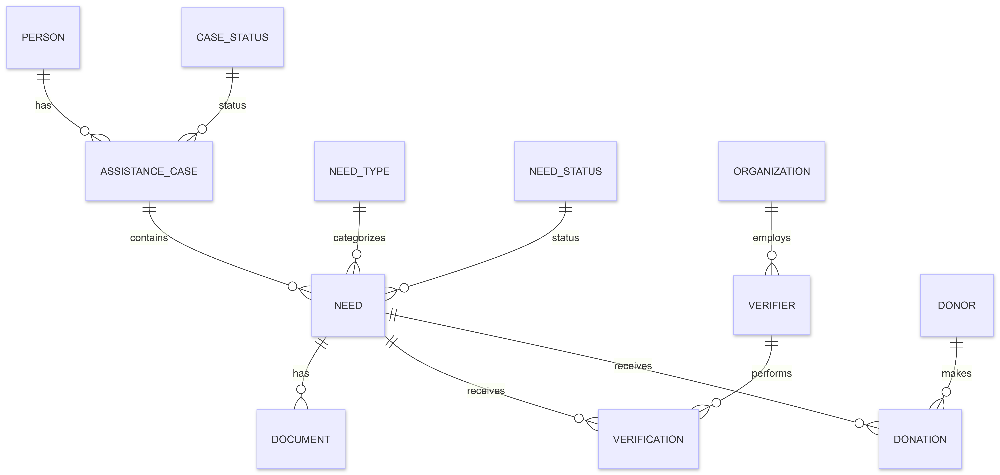

# Design Document

By Zakareyya Dandan

Video overview: <[Verified Financial Assistance Platform (VFAP) | CS50 SQL Final Project](https://youtu.be/FziJtAV8oMY?si=BTeOTSd1Ir2jTR4n)>

## Scope

The purpose of this database is to provide a structured system for managing verified financial assistance cases. Rather than simply recording individuals in need, the database focuses on documenting **specific assistance cases**, the individual needs associated with those cases, and the verification process performed by trusted organizations. It is intended to promote transparency and accountability in charitable giving by allowing donors to support needs that have been independently verified.

Included within the scope of this database are:

- People requesting financial assistance
- Assistance cases opened for individuals
- Individual needs within each assistance case (e.g., rent, medical expenses, education)
- Categories and statuses of needs
- Supporting documents submitted as evidence
- Verification records performed by authorized verifiers
- Organizations employing verifiers
- Donors and their donations toward verified needs

Outside the scope of this database are:

- User authentication and authorization
- Payment processing
- Storage of actual document files (only document metadata is stored)
- Fraud detection algorithms
- Appeals or dispute resolution
- Geographic mapping of beneficiaries
- Communication between donors and beneficiaries
- Financial accounting and tax reporting

## Functional Requirements

This database supports:

- Creating, updating, and managing people requesting assistance
- Opening multiple assistance cases for a person over time
- Recording multiple financial needs for each assistance case
- Categorizing needs by type and tracking their status
- Recording references to supporting documents
- Recording multiple independent verifications for a single need
- Recording organizations and their verifiers
- Recording donations made by donors toward individual needs
- Querying verified needs, donation history, outstanding funding requirements, and verification activity

This database does not support:

- Processing payments
- Authenticating users
- Uploading or storing physical files
- Automatically determining whether a need is legitimate
- Matching donors with beneficiaries
- Managing volunteer activities or logistics

## Representation

Entities are represented as SQLite tables with the following schema.

### Entities

The database includes the following entities.

### PERSON

The `PERSON` table stores individuals requesting financial assistance.

Attributes include:

- `person_id`, which specifies the unique identifier for a person. This column is an `INTEGER` and serves as the `PRIMARY KEY`.
- `first_name`, which stores the person's first name as `TEXT`.
- `last_name`, which stores the person's last name as `TEXT`.
- `date_of_birth`, which stores the person's date of birth as `NUMERIC`.
- `country`, which stores the person's country as `TEXT`.
- `phone`, which stores contact information as `TEXT`.
- `email`, which stores email information as `TEXT`.
- `created_at`, which stores the creation timestamp as `NUMERIC`.

The `PERSON` table represents individuals separately from assistance cases because a person may require assistance multiple times throughout their life.

---

### ASSISTANCE_CASE

The `ASSISTANCE_CASE` table represents a specific period where a person requires assistance.

Attributes include:

- `case_id`, which specifies the unique identifier for a case. This column is an `INTEGER` and serves as the `PRIMARY KEY`.
- `person_id`, which references the associated person. This column is an `INTEGER` and serves as a `FOREIGN KEY` referencing `PERSON(person_id)`.
- `case_status_id`, which references the current status of the case. This column is an `INTEGER` and serves as a `FOREIGN KEY` referencing `CASE_STATUS(case_status_id)`.
- `title`, which provides a short description of the case as `TEXT`.
- `description`, which provides additional details about the case as `TEXT`.
- `opened_at`, which stores the opening timestamp as `NUMERIC`.
- `closed_at`, which stores the closing timestamp as `NUMERIC`.

Separating cases from people allows the database to maintain historical assistance records.

---

### CASE_STATUS

The `CASE_STATUS` table stores possible statuses for assistance cases.

Attributes include:

- `case_status_id`, which is the unique identifier stored as an `INTEGER` and serves as the `PRIMARY KEY`.
- `status`, which stores the status name as `TEXT`.

A separate table prevents inconsistent status values from being entered.

---

### NEED

The `NEED` table represents a specific assistance requirement belonging to an assistance case.

Attributes include:

- `need_id`, which specifies the unique identifier for a need. This column is an `INTEGER` and serves as the `PRIMARY KEY`.
- `case_id`, which references the related assistance case. This column is an `INTEGER` and serves as a `FOREIGN KEY` referencing `ASSISTANCE_CASE(case_id)`.
- `need_type_id`, which references the category of the need. This column is an `INTEGER` and serves as a `FOREIGN KEY` referencing `NEED_TYPE(need_type_id)`.
- `need_status_id`, which references the current status of the need. This column is an `INTEGER` and serves as a `FOREIGN KEY` referencing `NEED_STATUS(need_status_id)`.
- `amount_requested`, which stores the requested amount as `NUMERIC`.
- `currency`, which stores the currency code as `TEXT`.
- `priority`, which stores the urgency level as `TEXT`.
- `description`, which stores additional details about the need as `TEXT`.
- `created_at`, which stores the creation timestamp as `NUMERIC`.

The `NEED` entity is the central entity of the database because verification and donations are linked directly to individual needs.

---

### NEED_TYPE

The `NEED_TYPE` table stores categories of assistance needs.

Examples include medical assistance, housing, education, and food.

Attributes include:

- `need_type_id`, which is an `INTEGER` primary key.
- `type`, which stores the category name as `TEXT`.
- `description`, which provides additional details as `TEXT`.

---

### NEED_STATUS

The `NEED_STATUS` table stores possible statuses for needs.

Attributes include:

- `need_status_id`, which is an `INTEGER` primary key.
- `status`, which stores the status name as `TEXT`.

Examples include Pending or Funded.

---

### DOCUMENT

The `DOCUMENT` table stores metadata about evidence supporting a need.

Attributes include:

- `document_id`, which is an `INTEGER` primary key.
- `need_id`, which references the related need as an `INTEGER` foreign key referencing `NEED(need_id)`.
- `document_type`, which stores the document category as `TEXT`.
- `file_name`, which stores the file reference as `TEXT`.
- `uploaded_at`, which stores the upload timestamp as `NUMERIC`.

The database stores document references only and does not store the actual files.

---

### VERIFICATION

The `VERIFICATION` table stores verification events performed by authorized individuals.

Attributes include:

- `verification_id`, which is an `INTEGER` primary key.
- `need_id`, which references the verified need as an `INTEGER` foreign key referencing `NEED(need_id)`.
- `verifier_id`, which references the person performing the verification as an `INTEGER` foreign key referencing `VERIFIER(verifier_id)`.
- `comments`, which stores verification notes as `TEXT`.
- `verified_at`, which stores the verification timestamp as `NUMERIC`.

A need can have multiple verification records from different organizations.

---

### ORGANIZATION

The `ORGANIZATION` table stores organizations participating in the verification process.

Attributes include:

- `organization_id`, which is an `INTEGER` primary key.
- `name`, which stores the organization name as `TEXT`.
- `organization_type`, which stores the organization category as `TEXT`.
- `email`, which stores email information as `TEXT`.
- `phone`, which stores contact information as `TEXT`.
- `country`, which stores the organization's country as `TEXT`.

---

### VERIFIER

The `VERIFIER` table stores individuals authorized to verify assistance needs.

Attributes include:

- `verifier_id`, which is an `INTEGER` primary key.
- `organization_id`, which references the organization as an `INTEGER` foreign key referencing `ORGANIZATION(organization_id)`.
- `first_name`, which stores the verifier's first name as `TEXT`.
- `last_name`, which stores the verifier's last name as `TEXT`.
- `role`, which stores the verifier's role as `TEXT`.
- `email`, which stores contact information as `TEXT`.

---

### DONOR

The `DONOR` table stores individuals or entities providing donations.

Attributes include:

- `donor_id`, which is an `INTEGER` primary key.
- `first_name`, which stores the donor's first name as `TEXT`.
- `last_name`, which stores the donor's last name as `TEXT`.
- `email`, which stores contact information as `TEXT`.
- `country`, which stores the donor's country as `TEXT`.

---

### DONATION

The `DONATION` table stores donations made toward specific needs.

Attributes include:

- `donation_id`, which is an `INTEGER` primary key.
- `donor_id`, which references the donor as an `INTEGER` foreign key referencing `DONOR(donor_id)`.
- `need_id`, which references the supported need as an `INTEGER` foreign key referencing `NEED(need_id)`.
- `amount`, which stores the donation amount as `NUMERIC`.
- `currency`, which stores the donation currency as `TEXT`.
- `anonymous`, which stores whether the donation is anonymous as an `INTEGER` where `0` represents false and `1` represents true.
- `donated_at`, which stores the donation timestamp as `NUMERIC`.

---

### Relationships

The below entity relationship diagram describes the relationships among the entities in the database.

The relationships are:

- One `PERSON` can have zero or many `ASSISTANCE_CASE` records. Each `ASSISTANCE_CASE` belongs to exactly one `PERSON`.
- One `CASE_STATUS` can describe zero or many `ASSISTANCE_CASE` records. Each `ASSISTANCE_CASE` has exactly one `CASE_STATUS`.
- One `ASSISTANCE_CASE` can contain zero or many `NEED` records. Each `NEED` belongs to exactly one `ASSISTANCE_CASE`.
- One `NEED_TYPE` can categorize zero or many `NEED` records. Each `NEED` has exactly one `NEED_TYPE`.
- One `NEED_STATUS` can describe zero or many `NEED` records. Each `NEED` has exactly one `NEED_STATUS`.
- One `NEED` can have zero or many `DOCUMENT` records. Each `DOCUMENT` belongs to exactly one `NEED`.
- One `NEED` can have zero or many `VERIFICATION` records. Each `VERIFICATION` belongs to exactly one `NEED`.
- One `VERIFIER` can perform zero or many `VERIFICATION` records. Each `VERIFICATION` is performed by exactly one `VERIFIER`.
- One `ORGANIZATION` can employ zero or many `VERIFIER` records. Each `VERIFIER` belongs to exactly one `ORGANIZATION`.
- One `DONOR` can make zero or many `DONATION` records. Each `DONATION` belongs to exactly one `DONOR`.
- One `NEED` can receive zero or many `DONATION` records. Each `DONATION` supports exactly one `NEED`.

## Optimizations

### Indexes:

The following indexes improve query performance for common operations:

* `idx_person_name` on `PERSON(first_name, last_name)`: Speeds up searching for people by name.

* `idx_assistance_case_person` on `ASSISTANCE_CASE(person_id)`: Speeds up retrieving all assistance cases belonging to a specific person.

* `idx_assistance_case_status` on `ASSISTANCE_CASE(case_status_id)`: Speeds up filtering assistance cases by their status.

* `idx_need_case` on `NEED(case_id)`: Speeds up joins between needs and their associated assistance cases.

* `idx_need_status` on `NEED(need_status_id)`: Speeds up filtering needs based on their current status.

* `idx_need_type` on `NEED(need_type_id)`: Speeds up joins between needs and their categories.

* `idx_document_need` on `DOCUMENT(need_id)`: Speeds up retrieving supporting documents associated with a specific need.

* `idx_verification_need` on `VERIFICATION(need_id)`: Speeds up retrieving verification records for a specific need.

* `idx_verification_verifier` on `VERIFICATION(verifier_id)`: Speeds up retrieving verification records performed by a specific verifier.

* `idx_verifier_organization` on `VERIFIER(organization_id)`: Speeds up grouping and retrieving verifiers belonging to an organization.

* `idx_donation_need` on `DONATION(need_id)`: Speeds up calculating total donations received for a specific need.

* `idx_donation_donor` on `DONATION(donor_id)`: Speeds up calculating total contributions made by a specific donor.

### Views:

- **Verified needs awaiting funding:** `Needs_awaiting_funding` Displays all pending funding needs with their total donations received, sorted by priority.

- **Verification history by organization:** `Verification_history_by_organization` Displays the verification history for assistance needs, grouped by organization and sorted by most recent verification.

- **All time donor contribution summary:** `All_time_donor_contribution_summary` Displays each donor's total lifetime contributions, ranked from highest to lowest.

- **Fully funded needs:** `Fully_funded_needs` Displays needs that have received donations equal to or greater than the requested amount.

## Limitations

This database focuses on storing and organizing assistance information. It does not independently determine whether a request is legitimate.

Verification depends on trusted organizations and their internal processes.

The current design assumes that each `VERIFIER` belongs to only one `ORGANIZATION`. Supporting independent auditors working with multiple organizations would require a many-to-many relationship.

The `DOCUMENT` table stores only metadata and does not manage physical document storage.

The `DONATION` table assumes each donation supports one `NEED`. Supporting a donation distributed across multiple needs would require an additional relationship table.

The database does not currently handle country-specific privacy laws, currency conversion, multilingual information, or identity verification standards.
