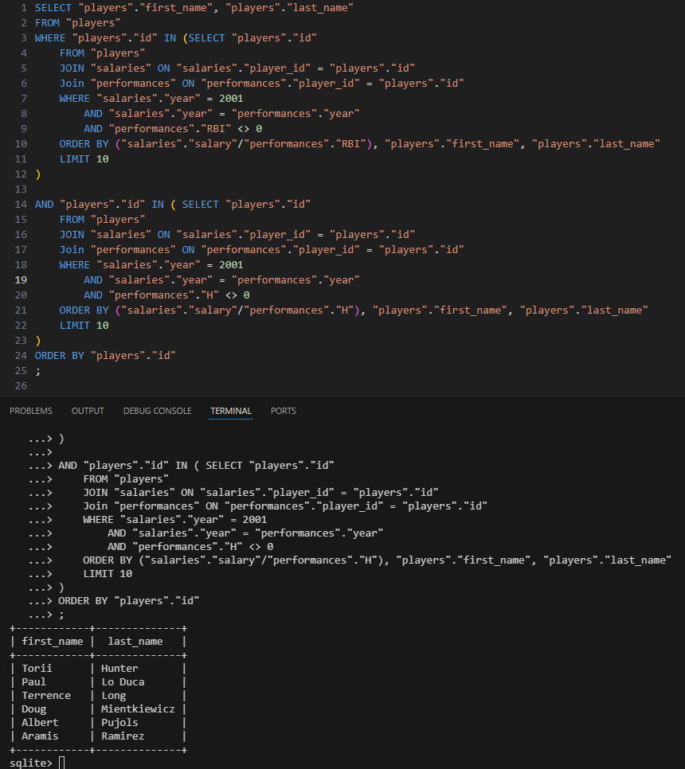

# Week 1: Relating

## Overview

This week introduced the principles of relational databases and how data can be connected across multiple tables. It explored database relationships, keys, joins, subqueries, set operations, and grouping techniques, providing the foundation for querying data that spans related entities.

## Topics Covered

- Relational Databases
- Relationships
  - One-to-one
  - One-to-many
  - Many-to-many
- Entity Relationship Diagrams (ERDs)
- Keys
  - Primary Keys
  - Foreign Keys
- Subqueries
- IN
- Joins
  - INNER JOIN
  - Outer Joins
  - LEFT JOIN
  - RIGHT JOIN
  - FULL JOIN
  - NATURAL JOIN
- Set Operations
  - INTERSECT
  - UNION
  - EXCEPT
- Grouping Data
  - GROUP BY
  - HAVING

---

## Most Interesting Assignment: Moneyball

The **Moneyball** assignment applies the concepts of relational databases to analyze historical Major League Baseball data stored across multiple related tables.

Throughout the assignment, SQL queries are used to answer analytical questions by combining player, salary, and performance data. It serves as a practical exercise in navigating relationships between tables and extracting meaningful insights from interconnected datasets.

### Specification 12: `12.sql`

This query identifies the player who achieved the **lowest cost per hit during the 2001 season**.

To accomplish this, it combines player statistics with salary information, calculates the salary paid for each recorded hit, and returns the player with the lowest value.

It demonstrates the use of:

- INNER JOIN
- Filtering records using `WHERE`
- Arithmetic calculations
- Aliasing columns using `AS`
- `ORDER BY`
- `LIMIT`

The following screenshot shows the output of this query after execution:

