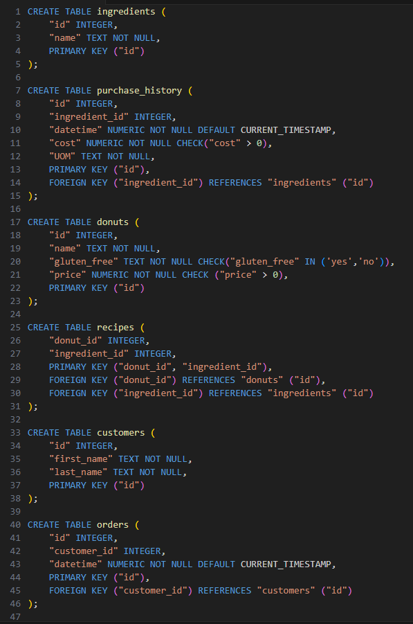

# Week 2: Designing

## Overview

This week focused on designing well-structured relational databases by introducing database schemas, normalization, data types, constraints, and techniques for modifying existing database structures. These concepts provide the foundation for creating databases that are organized, maintainable, and enforce data integrity.

## Topics Covered

- Schemas
- Normalizing
- Data Types
- Storage Classes
- Type Affinities
- Table Constraints
  - PRIMARY KEY
  - FOREIGN KEY
- Column Constraints
  - CHECK
  - DEFAULT
  - NOT NULL
  - UNIQUE
- Altering Tables
  - DROP TABLE
  - ALTER TABLE
  - ADD COLUMN
  - RENAME COLUMN
  - DROP COLUMN
- Charlie

---

## Most Interesting Assignment: Donuts

The **Donuts** assignment focuses on designing the database for **Union Square Donuts**, requiring the creation of a relational schema capable of organizing the business's operational data.

Rather than querying an existing database, this assignment emphasizes database design by translating real-world requirements into a structured schema. It reinforces the importance of selecting appropriate data types, defining relationships, and applying constraints to ensure data integrity and consistency.

### Specification: `schema.sql`

This specification involves creating the complete database schema for the application, including the necessary tables, relationships, and constraints required to support the business requirements.

It demonstrates the use of:

- Database schema design
- Table creation
- Primary keys
- Foreign keys
- Column constraints
- Appropriate data types
- Relational modeling

The following screenshot shows the database schema created for this specification:

