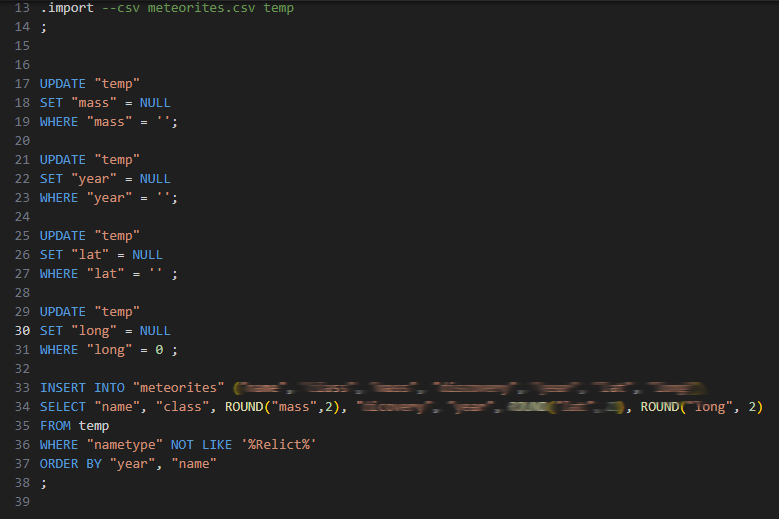

# Week 3: Writing

## Overview

This week focused on modifying data within relational databases by introducing the core Create, Read, Update, and Delete (CRUD) operations. It explored how to insert, update, and remove data, import datasets from CSV files, enforce foreign key constraints, automate actions with triggers, and implement soft deletions.

## Topics Covered

- Create, Read, Update, Delete (CRUD)
- INSERT INTO
- CSVs
- `.import`
- DELETE FROM
- Foreign Key Constraints
- UPDATE
- Triggers
- Soft Deletions

---

## Most Interesting Assignment: Meteorites

The **Meteorites** assignment focuses on preparing and importing a real-world meteorite landings dataset into a relational database. Rather than working with data that is already structured, the assignment emphasizes transforming and loading external data while ensuring it is suitable for database storage and analysis.

This assignment highlights an important step in the data lifecycle by demonstrating how raw datasets can be cleaned, standardized, and imported into a relational database before they can be queried effectively.

### Specification: `import.sql`

This specification creates the SQL script responsible for importing the meteorite dataset into the database. It prepares the data for future analysis by defining the import process and ensuring that records are loaded into the appropriate database structure.

It demonstrates the use of:

- Importing data from CSV files
- SQLite `.import`
- Data preparation
- INSERT operations
- Working with structured datasets

The following screenshot shows the import process defined in this specification:

