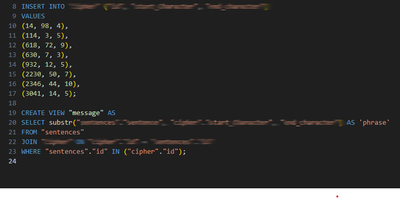

# Week 4: Viewing

## Overview

This week focused on simplifying, organizing, and securing access to data through the use of database views. It introduced permanent and temporary views, Common Table Expressions (CTEs), and techniques for presenting data in more meaningful and reusable ways while supporting data partitioning and soft deletion strategies.

## Topics Covered

- Views
- CREATE VIEW
- Views for Simplifying
- Views for Aggregating
- Temporary Views
- CREATE TEMPORARY VIEW
- Common Table Expressions (CTEs)
- Views for Partitioning
- Views for Securing
- Soft Deletions

---

## Most Interesting Assignment: The Private Eye

The **The Private Eye** assignment demonstrates how SQL views can be used to simplify complex investigations by presenting only the information needed to solve a case. Instead of repeatedly writing long and complex queries, the assignment builds reusable views that progressively narrow down the available data and make the investigation easier to follow.

This assignment showcases how views can improve readability, organization, and maintainability when working with interconnected datasets.

### Specification: `private.sql`

This specification creates the SQL views required to organize the investigation and reveal the information needed to solve the case. By building reusable views, the solution transforms complex queries into a series of logical steps that are easier to understand and maintain.

It demonstrates the use of:

- CREATE VIEW
- Reusable database views
- Query abstraction
- Organizing complex queries
- Working with related datasets

The following screenshot shows the implementation of this specification:

