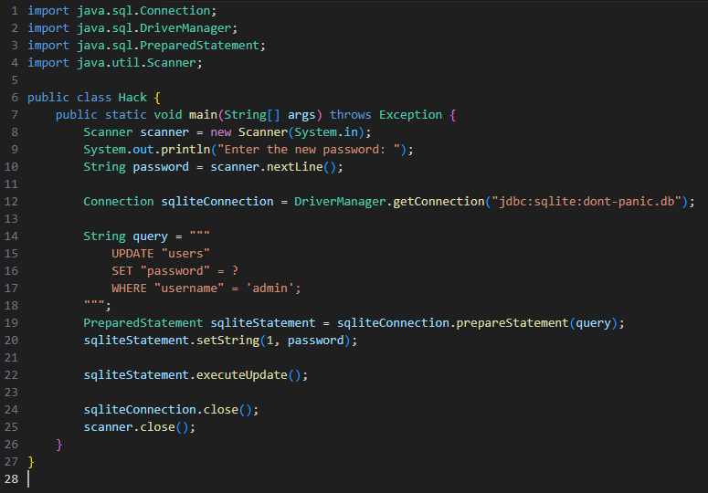

# Week 6: Scaling

## Overview

This week focused on how databases can handle increasing amounts of data, users, and operational demands. It introduced database scalability concepts, different database management systems, security considerations, and techniques used to improve reliability and performance when building larger database applications.

## Topics Covered

- Scalability
- MySQL:
  - Integers
  - Strings
  - Dates
  - Times
  - Real Numbers
  - Floating-Point Imprecision
  - Fixed Precision
  - Altering Tables
- Stored Procedures
- PostgreSQL
- Vertical Scaling
- Horizontal Scaling
- Replication
- Read Replicas
- Sharding
- Access Controls:
  - GRANT
  - REVOKE
- SQL Injection Attacks
- Prepared Statements

---

## Most Interesting Assignment: Don't Panic!

The **Don't Panic!** assignment explores database security by demonstrating how applications interact with databases and how unsafe handling of user input can expose systems to SQL injection vulnerabilities.

The assignment connects SQL concepts with application development by showing the importance of secure database communication and the use of prepared statements to prevent malicious queries from being executed.

### Specification: `Hack.java`

This specification focuses on modifying a Java application to interact with a database and demonstrate how SQL injection attacks can occur when user input is not handled securely.

It demonstrates the use of:

- Database connections from an application
- Executing SQL queries through application code
- Understanding SQL injection vulnerabilities
- Prepared statements as a security practice
- The relationship between application code and database security

The following screenshot shows the implementation of this specification:

